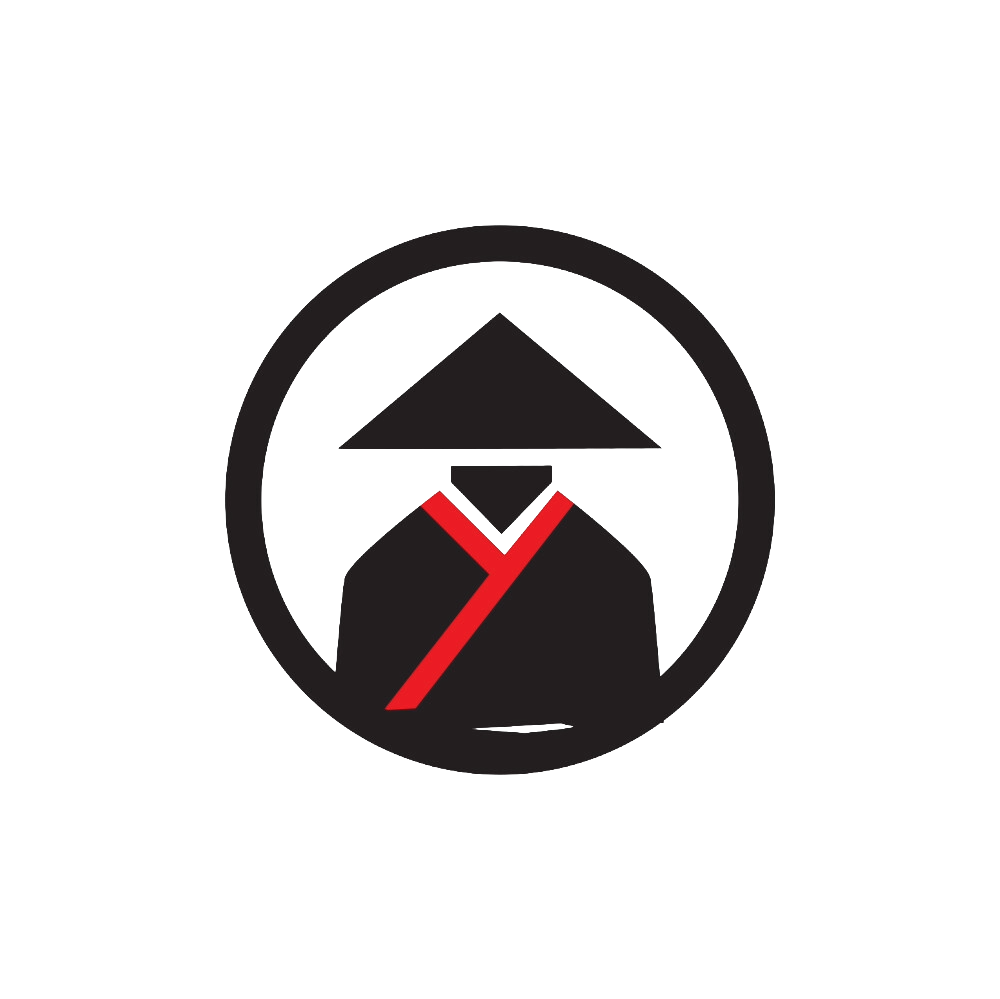

# SAM-ARIZE APP

## Overview
Welcome to the SAM-ARIZE App, where asset and inventory management made simpler.

## 🎮 Features
- **Auth**: Sign up, log in/out (Django auth); friendly auth pages and navbar logic.
- **Assets**: Create, view, update, delete assets (serial number, purchase date, status, category, location).
- **Inventory**: Manage inventory items with quantity and unit price.
- **Categories & Locations**: CRUD for organizing assets/inventory.
- **Suppliers**: Track supplier info and contacts.
- **Purchase Orders**: Create and manage POs with statuses (pending → delivered).
- **Ownership**: Records (where applicable) track `owner` (created by).
- **Responsive UI**: Mobile-friendly nav with orange toggle; sticky footer.
- **Styling**: Shared auth form styles, base palette, and a bold hero-like homepage.

## 🌐 Links
→ [Deployment Link (Not Ready)]()
→ [GitHub Repo Link](https://github.com/nesaratai/sam-arize)
→ [Notion Planning Link](https://www.notion.so/240ed4d6f92d80d89459d2722eace895?v=240ed4d6f92d80cfa2af000c41552a7a&source=copy_link)

## 💻 Technologies

This application uses the following:

* **Python**, **Django**
* **HTML/CSS** 
* **PostgreSQL**
* **Django Bootstrap5** 

## 🔮 Stretch Goals
🔐 User Experience & Security
Two-Factor Authentication (2FA): Add an extra security layer for admins.

📊 Dashboard & Analytics
 • Exportable Reports: Export purchase orders, supplier performance, and inventory data to CSV, PDF, or Excel.
 • Advanced Charts: Add bar charts for monthly spend, pie charts for category distribution, and trend lines for supplier performance.
 • KPIs: Add metrics like average delivery time, purchase order fulfillment rate, or monthly spend vs. budget.

 📦 Inventory & Asset Management
 • Barcode/QR Code Integration: Scan assets or inventory items directly into the system for updates.
 • Depreciation Tracking: For assets, calculate depreciation 
 • Low Stock Alerts: Trigger email/notification when items hit a reorder threshold.

 🛒 Procurement Enhancements
 • Purchase Order Approval Flow: Add an approval process where Managers must approve before an order is confirmed.
 • Supplier Ratings & Notes: Rate suppliers on timeliness, quality, and reliability for better decision-making.
 • Recurring Orders: Option to auto-create POs for frequently ordered items.

 🌐 Integrations & Extensions
 • Email Notifications: Send automatic emails to suppliers when a PO is created or updated.
 • API Endpoints: Expose a REST API so it can integrate with other systems.
 • Cloud Storage: Upload and store supplier contracts, receipts, or invoices.

🎨 UI/UX Improvements
 • Dark/Light Theme Toggle: You already themed the dashboard black & orange — let users switch between themes.
 • Search & Filters Everywhere: Add quick search boxes and filter dropdowns on every list view (suppliers, assets, categories, etc.).
## 🎨 Creators

**Nesar Atayi**
**Marco Philip Agapito**
**Yaya Sanyang**

